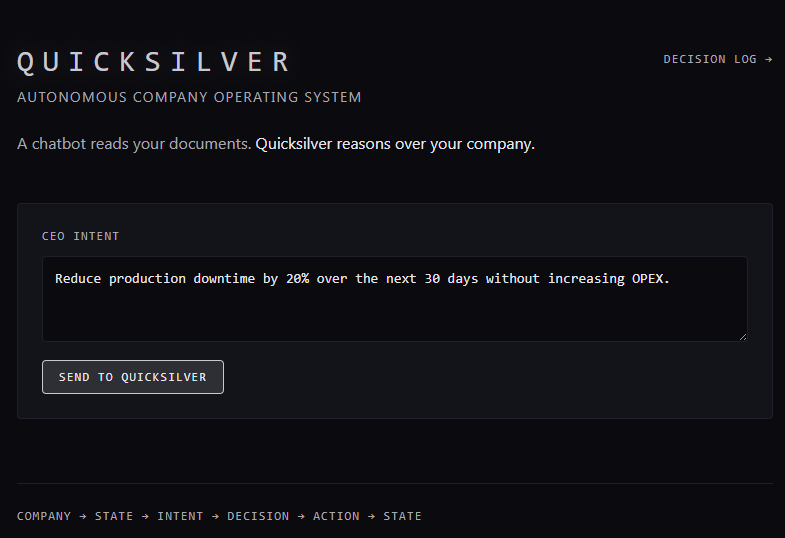
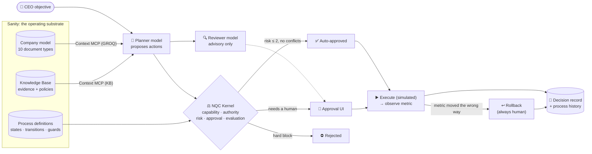
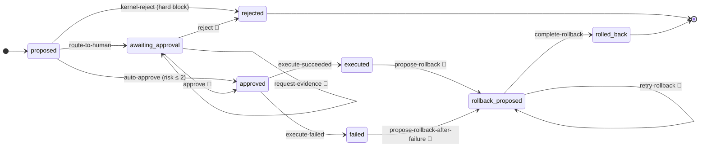

<div align="center">

# ⚡ Nuera Quicksilver

### Enterprise cognitive and automation subsystem for Nuera RDL

**An intent-driven company operating system: state an objective, and Quicksilver organizes, experiments, operates and learns under deterministic governance.**

**NQC Kernel governs. Quicksilver Engine evaluates. Nuera Quicksilver Agents do the work.**


[**Docs**](./docs/README.md) ·
[**Product definition**](./docs/NUERA-QUICKSILVER-PRODUCT.md) ·
[**NQC Kernel**](./docs/nqc/README.md) ·
[**Platform**](./docs/platform/README.md) ·
[**Spec coverage**](./docs/NUERA-QUICKSILVER-SPEC-COVERAGE.md) ·
[**Roadmap**](./docs/NUERA-QUICKSILVER-ROADMAP.md) ·
[**Build log**](./BUILD-LOG.md)

</div>

> **Which repository is this?**
>
> | Repository | What it is |
> |---|---|
> | **[nuerainc/project-quicksilver](https://github.com/nuerainc/project-quicksilver)** (this repo) | **Nuera Quicksilver**, the ongoing cognitive and automation platform. It is under active development, is not deployed, and has no live demo. |
> | **[nuerainc/quicksilver-sanity-challenge](https://github.com/nuerainc/quicksilver-sanity-challenge)** | **Quicksilver**, our Sanity Challenge 2026 submission. It holds the live demo, the challenge Studio, and the DEV posts, and it stays as it was submitted. |
>
> Project Quicksilver was inspired by our Sanity Challenge submission and started from its codebase. See [Origins](#origins).
> **Current build status:** Nuera Quicksilver keeps the tested decision-governance foundation it inherited from the challenge build as its regression baseline. NQC evaluation and governance, tool contracts, a draft workflow builder, and an in-process graph runner are implemented foundations. Quicksilver Engine also provides a bounded, provider-neutral final-answer stress harness for multi-step arithmetic and logic traps; it does not request or retain private chain-of-thought. The editor visualizes graph connections and exposes agent retry and handler timeout settings. The runner supports opt-in bounded concurrency for independent low/moderate-impact agent steps; the read-only query route caps this at three. The read-only query worker uses a shared governed-agent contract and returns its full NQC evaluation response. Workflow drafts autosave locally, support validated JSON import/export, and can run an opt-in read-only query-agent path through NQC evaluation. Workflow tools remain blocked. A durable run queue and worker (`@quicksilver/kernel/runtime`) now provide idempotent admission, backpressure, leases, cancellation, retries, and a dead-letter queue, with in-memory, journaled-file, or PostgreSQL storage; cron schedules and signed webhooks can start runs. A single-tenant host process (`@quicksilver/host`) now runs the worker pool, schedules and signed webhooks from configuration, with a bearer-token management API, an encrypted secrets vault, structured logs and Prometheus metrics. Kernel RBAC (tenant isolation, deny-by-default roles, no authority for agents) guards queue operations, the host API and, when configured, per-person supervisor credentials. Decision approvals enforce separation of duties, with an audited sole-operator override, and every query and workflow evaluation is stored as an `evaluationRecord`. An internal TypeScript SDK and a dependency-free Python SDK/CLI foundation now cover workflow validation, safe preview, and opt-in read-only runs; neither is published as a stable public API. SSO/accounts UI, multi-tenant hosting, traces and dashboards, a Go SDK, and a marketplace remain unimplemented.
>
> Canonical product docs: [Product definition](./docs/NUERA-QUICKSILVER-PRODUCT.md) · [Documentation index](./docs/README.md) · [NQC Kernel](./docs/nqc/README.md) · [Platform](./docs/platform/README.md) · [Spec coverage](./docs/NUERA-QUICKSILVER-SPEC-COVERAGE.md) · [Roadmap](./docs/NUERA-QUICKSILVER-ROADMAP.md)

<p align="center">
  <br>
  <sub>The objective console, carried over from the challenge build.</sub>
</p>

---

Give Nuera Quicksilver an objective like *"Reduce production downtime by 20% without increasing OPEX."* A **Nuera Quicksilver Agent** reads a structured company model stored in Sanity and proposes a plan. The **NQC Kernel** applies the deterministic Quicksilver Engine evaluation and then decides what may happen. Each proposed action is auto-approved, sent to a human, or hard-blocked. Every step is recorded as an auditable decision in Sanity.

> **Nuera Quicksilver Agents propose. The NQC Kernel authorizes. The company's playbook is content, and the kernel runs it.**

## What Nuera Quicksilver is building

The [product definition](./docs/NUERA-QUICKSILVER-PRODUCT.md) is the canonical
statement of where this repository is headed. It describes the target, not
current capability.

Nuera Quicksilver is being built as an **intent-driven company operating
system**. A human states an objective and whatever constraints they know, from
"make money" to an exact process. Quicksilver works out what's still undecided,
builds the organization of agents it needs, and runs the company through
governed loops. Every action is proposed by an agent, authorized by the NQC
Kernel, and recorded.

### Layers

| Layer | What it does | Status |
|---|---|---|
| **Foundation:** platform runtime | Durable runs, triggers, agent manifests, governed memory, routing, SDKs | Foundation |
| **Layer 1:** NQC Kernel loop | Propose → evaluate → authorize → route → supervisor approval → execute and log, for every action | Built / Foundation |
| **Layer 2:** intent loop | Turns an objective into a decision graph whose values are tagged by provenance (`HUMAN_SPECIFIED`, `OBSERVED`, `AGENT_INFERRED`, `SYSTEM_CONSTRAINT`) | Not built yet |
| **Layer 3:** playbook loops | Swappable business playbooks, stored as content: process stages that run workflow graphs | Building blocks exist |

### Operating modes

- **Genesis:** starts a business from nothing, using experiments with paid signals and thresholds set in advance.
- **Onboard:** takes over an existing business: connect → interview → backtest → shadow mode → earn autonomy one department at a time.
- **Operate:** runs a validated business, optimizing and reinvesting within governance.

### Goals

1. **Governed autonomy:** every action passes through the NQC Kernel, and agents never hold authority.
2. **Any objective at any autonomy depth,** through a single intent entry point.
3. **Genesis, Onboard and Operate** on one core.
4. **Playbooks as content,** swappable without changing the core.
5. **Capital follows evidence,** through measured experiments.
6. **Accountability:** every decision traced to a human, observed data, an inference or a constraint.
7. **Wellbeing alignment,** with WAES review of every offer, claim and outbound message.
8. **Platform baseline parity,** proven by a pass/fail test for each baseline item.

**Version:** 0.1.0. Following the Nuera RDL versioning standard, Nuera Quicksilver stays on 0.x until all three modes pass the
parity gate; each milestone raises the minor version (M1 → 0.2.0 … M6 → 0.7.0), and
1.0.0 requires operational evidence for every mode.

Milestones M1–M6, the versioning table and the success metrics are in the
[product definition](./docs/NUERA-QUICKSILVER-PRODUCT.md#8-goals). What
exists today is described below.

## How it works



## Why it isn't "just RAG"

A keyword search finds *"Engineering approval is required for parameter changes."* Quicksilver works out things a search can't, and it's clear about which part does what: the **kernel** is deterministic code, the **agent** is the LLM reading Sanity.

| Question | Worked out by |
|---|---|
| Does this actor actually **hold the capability**, and is it granted? | Kernel, from `entity` → `capability` references |
| Which policies **apply**, which are **superseded**, which **conflict**? | Kernel: policy scope + `supersedes[]`; two live policies in the same scope are flagged as a conflict |
| Does any evidence **contradict** the plan, and how confidently? | Agent, from `evidence.contradicts[]` + confidence (GROQ) and the Knowledge Base's own contradiction detection |
| How **risky** is it: base risk, impact, reversibility, uncertainty? | Kernel, a deterministic formula, 0–5 |
| Who has to approve, and **what can happen next**? | Kernel, running the Decision Lifecycle process stored in Sanity |

The seed data includes a real dilemma. Operations Policy 17 and Emergency Policy 4 conflict in the same scope, and a historical incident (confidence 0.92) says the root cause is mechanical, not parameter drift. The agent has to reason through a conflict that is actually in the data, not a staged one.

## The playbook is content

Every decision moves through the **Decision Lifecycle**, a process definition stored as a Sanity document and run by the kernel. It has 8 states and 12 transitions. Its guards are structured data (`{ fact, op, value }`), never code strings.



- **Tighten the autonomy ceiling in Studio** by changing one number, and the next decision follows it, with no redeploy.
- **Illegal jumps are refused** with a plain-English reason. Approve, reject and rollback always need a human click; the kernel and executor can never take them. (Per-person supervisor credentials and kernel RBAC are enforced when `QUICKSILVER_PRINCIPALS` is configured; otherwise a local instance falls back to a single supervisor token. SSO and browser sessions are on the roadmap.)
- **Every step is stamped** with the definition's version and `_rev`, so you can see exactly which rules were in force.
- **A broken definition stops the line.** If a state is unreachable or a guard is malformed, the kernel moves nothing rather than bypassing its own playbook.
- **Optimistic locking**: two simultaneous approvals give exactly one success and one clean `409`.

## Trying it

Nuera Quicksilver has **no hosted demo**. Run it locally (see [Run it locally](#run-it-locally)); then:

1. Open the console at `http://localhost:3000`. The objective is pre-filled.
2. Click **Send to Quicksilver**. A real plan takes about a minute.
3. Scroll to **Decisions**. Each card shows the kernel's risk and verdict and a **Process** line (where it is, what can happen next). Click **Show reasoning & evidence** for the policies, evidence and the dashed **Independent review** from the reviewer model.
4. **Approve** a card, **Execute** it (simulated) and **Observe** the metric. If it moves the wrong way, **propose a rollback**.
5. Open `/decisions` to see every transition, who took it (kernel, human or executor) and when. Open `/workflows` for the draft workflow builder.

Local runs need a configured Sanity project and model credentials. The live demo
at quicksilver-seven.vercel.app belongs to the
[challenge submission](https://github.com/nuerainc/quicksilver-sanity-challenge), not to this repository.

## Tests

| Check | Result |
|---|---|
| Kernel suites (`npm run kernel:test`): authorization, risk, process engine, workflow graphs and runtime, Quicksilver Engine, NQC, routing, memory, registries, durable run queue, identity/RBAC, triggers, run-store contract (memory, file, Postgres) | **213 / 213** |
| Agent tests: model config, strict-schema guards for every model schema, agent contracts | **17 / 17** |
| Host tests (`npm run host:test`): management API and auth, worker, blocked tools, webhooks, vault and rotation, logs, metrics, config validation | **29 / 29** |

Inherited from the challenge build, and run against that build's live
environment rather than this repository: a live governance stress test (lanes,
races, prompt injection, a broken definition, **17 / 17**) and an automated
live e2e (`npm run e2e:live`, **44 / 44**), both against Decision Lifecycle v2.
They have not been re-run against the dedicated Nuera Quicksilver project.

The challenge-era stress test found real bugs: a risk formula that scored nearly everything 5/5, a failed rollback that could strand a decision, and a strict-schema error on the query route. Each one is fixed and written up in the [build log](./BUILD-LOG.md).

## Stack

| Layer | Choice |
|---|---|
| App | Next.js 15 (App Router), TypeScript, Tailwind; not currently deployed |
| Content & state | Dedicated Nuera Quicksilver Sanity project (`f87t11g1`), pending configuration; the challenge dataset is not used by this repo |
| Agent read path | Sanity **Context MCP**, in both GROQ mode (live dataset) and Knowledge Base mode (cited, with contradiction detection) |
| Agent harness | AI SDK 6 + `@ai-sdk/mcp`, role-based models (planner + independent reviewer; Azure OpenAI in production) |
| Authority | **NQC Kernel**: deterministic TypeScript with no LLM, fail-closed |
| Evaluation | **Quicksilver Engine**: deterministic grounding, tool-failure, and brittleness signals |
| Worker agents | **Nuera Quicksilver Agents**: planner, advisory reviewer, and query agent; kernel manifests gate registered tasks, with the NQC Kernel retaining action authority |
| Write path | `@sanity/client` mutations with `ifRevisionId` optimistic locking |
| Workflow authoring | Draft graph builder, browser-local autosave, validated JSON import/export, validation API, separate `automationWorkflow` schema, safe preview, and opt-in read-only query-agent run through NQC; tools blocked, safe data-only conditions, not shared or hosted |
| Developer SDK | Internal TypeScript client for workflow validation; not yet published |
| Python SDK/CLI | Internal Python client and `qs` CLI for validation, safe preview, and gated read-only runs; not published |
| Run runtime | `@quicksilver/kernel/runtime`: durable run records, in-memory / journaled-file / PostgreSQL stores, governed priority queue with dead letters, and a worker ([details](./docs/platform/durable-runs.md)) |
| Triggers | `@quicksilver/kernel/triggers`: UTC cron scheduler and HMAC-signed webhooks, enqueued under the `trigger` role ([details](./docs/platform/triggers.md)) |
| Hosted runtime | `@quicksilver/host`: single-tenant process with management API, secrets vault, JSON logs and Prometheus metrics; Docker and Compose in `deploy/` ([details](./docs/platform/hosted-runtime.md)) |

## Repository layout

```
project-quicksilver/
├── apps/
│   ├── web/            Next.js app: CEO console, Decision log, API routes
│   │   └── app/api/    plan · query · decisions/[id]/{action,execute,observe,rollback,resume}
│   └── studio/         Nuera Quicksilver Studio: core schemas, graph schema, guarded seed scripts
├── packages/
│   ├── kernel/         Deterministic authority, NQC, workflows, run runtime (no LLM)
│   ├── agent/          Planner, reviewer, query agent, MCP bindings, model roles
│   ├── host/           Single-tenant host: worker, schedules, webhooks, API, vault, logs, metrics
│   ├── sdk/            Internal TypeScript API client
│   └── sdk-python/     Internal Python SDK and `qs` CLI foundation
├── deploy/             Dockerfile, Compose (Postgres + host), example host config
├── docs/               Canonical NQC/platform docs plus historical challenge writeups (marked as such)
├── ARCHITECTURE.md     Design and data model
├── SUBMISSION.md       Historical: the Sanity Challenge submission record
└── BUILD-LOG.md        Day-by-day build history across every environment
```

## Run it locally

```bash
npm install
cp .env.example .env
# Set the dedicated project in the root .env and apps/studio/.env.
# Fill the new project's API token and Context MCP endpoints in the root .env.
npm run dev:studio
npm run dev:web
```

The dedicated Sanity project is `f87t11g1`, and local project IDs now point to
it. Schema deployment and seed writes remain pending until a new project-scoped API token is configured and the schema is
deployed. Set
`QUICKSILVER_PROCESS_ENGINE=on` to run the existing Decision Lifecycle process
engine from the configured project.

To run the hosted runtime (worker, schedules, webhooks, management API), see
[hosted runtime](./docs/platform/hosted-runtime.md):

```bash
cp deploy/quicksilver.host.example.json quicksilver.host.json
npm run host -- vault keygen    # set QUICKSILVER_VAULT_KEY
npm run host -- check
npm run host
```
## Origins

Project Quicksilver was inspired by **Quicksilver**, our submission to the
**[Sanity Challenge](https://dev.to/challenges)** (Sept 18 – Oct 4, 2026). That
submission lives in its own repository,
**[nuerainc/quicksilver-sanity-challenge](https://github.com/nuerainc/quicksilver-sanity-challenge)**,
with its live demo, and was entered in both paths:

- **Path One**, *Ship an Agent That Queries Real Content*: Quicksilver: An Autonomous Company Operating System
- **Path Two**, *Vibe-Code Something Strange*: Quicksilver: The Company That Operates Itself

Nuera Quicksilver started from that codebase and is not a challenge entry. Copies
of the challenge documents ([submission record](./SUBMISSION.md),
[Path One post](./docs/DEV-POST-PATH-ONE.md), [Path Two post](./docs/DEV-POST-PATH-TWO.md),
[demo script](./docs/DEMO-SCRIPT.md)) are kept here for history.

**MiniMax Agent** built the architecture through hardening. **Claude Code** (via Cowork) added the Knowledge Base integration, the live reviewer, the deployment, the process engine and the live testing. The manual work was done in **VS Code**. All of it is in one unified [build log](./BUILD-LOG.md), including every real error and how it was fixed. Later Nuera Quicksilver work (regression suites, the durable run runtime) was added with Claude in Cowork.

## License

[MIT](./LICENSE) © 2026 J.B.T. Beebe
