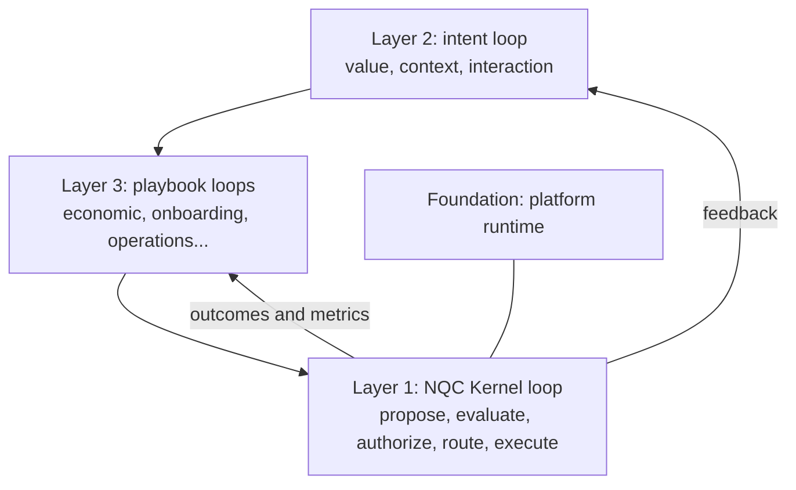

# Nuera Quicksilver — Product definition

This is the canonical definition of what Nuera Quicksilver is being built to
become. The [roadmap](NUERA-QUICKSILVER-ROADMAP.md) and
[spec coverage](NUERA-QUICKSILVER-SPEC-COVERAGE.md) track progress toward it.
It describes the **target product**, not current capability. Each section
carries a status label:

- **Built:** working and covered by the regression suites.
- **Foundation:** code exists but doesn't yet work end to end.
- **New:** this definition requires it, and the repository doesn't have it yet.

Nuera Quicksilver belongs to the Applied Engineering Platforms division of
Nuera Research & Developmental Laboratories (Nuera RDL).

---

## 1. What it is

Nuera Quicksilver is an **intent-driven company operating system**. A human
states an objective and whatever constraints they know. Quicksilver works out
what's still undecided, builds the organization of agents it needs, and runs
the company through governed loops. **Every action is proposed by an agent,
authorized by the deterministic NQC Kernel, and recorded.**

What sets it apart from an agent framework:

- **The layers are kept separate.** A deterministic kernel authorizes every
  action. An intent layer works out what the human wants. Playbooks decide what
  the company does.
- **No fixed business workflows.** Playbooks are content, so they can be
  swapped or edited without changing the core.
- **Roles emerge from capability, risk, tools, permissions and intent.** They
  aren't hard-coded. This is the same `entity` abstraction the kernel already
  uses, applied to the whole company.
- **Governance is structural.** The kernel, not the agent, decides what is
  allowed.

## 2. System layers

Quicksilver has three loop layers on top of a platform foundation. The
foundation, kernel and intent layers are fixed parts of the product. Playbooks
are content.

| Layer | Runs on | Stages | In this repository | Status |
|---|---|---|---|---|
| Foundation: platform runtime | Everything | Durable runs, triggers, agents, memory, SDKs | `packages/kernel/src/{runtime,triggers,agents,tools,nqc}`, `packages/sdk*` | Foundation |
| Layer 1: NQC Kernel loop | Every single action | Propose → evaluate (Quicksilver Engine) → authorize → route (auto-approve, human review or reject) → supervisor approval → execute and log | `packages/kernel` (`approval.ts`, `process.ts`, `engine/`, `nqc/`, `identity/`) | Built / Foundation |
| Layer 2: intent loop | Every objective and every change to it | Value ⇄ context ⇄ interaction, producing the decision graph | — | New |
| Layer 3: playbook loops | Chosen per mode and situation | Process stages that run workflow graphs | `process.ts` and `workflows/` provide the building blocks | New (blocks are Foundation) |

## 3. Layer 1: NQC Kernel loop (Built / Foundation)

The kernel is deterministic TypeScript with no LLM inside. Nuera Quicksilver
Agents can only propose. The Quicksilver Engine scores what they produce, and
the kernel decides. **Evaluation can make a decision stricter, never looser.**

- **Authorization:** capability grants, policy scope and supersession, evidence,
  and a 0–5 risk score. Anything at risk 2 or below with no concerns is
  approved automatically. Anything else goes to a human or is rejected.
- **Decision lifecycle:** 8 states and 12 transitions, stored as content in
  Sanity. Guards are `{ fact, op, value }` data and fail closed.
- **Evaluation:** grounding, tool-failure, uncertainty and brittleness signals.
  A weak or high-impact result escalates to a human. Private chain-of-thought
  is never collected.
- **Approval binding:** an approval is tied to the exact action and the policy
  revisions in force. If either changes before execution, the action is blocked.
- **Access control:** deny by default, isolated per tenant, and agents can
  never hold authority.

Details: [ARCHITECTURE.md](../ARCHITECTURE.md), [NQC Kernel](nqc/README.md),
[platform docs](platform/README.md).

**New for the product:** a spend risk scale suited to small budgets (the
current financial tiers treat any spend under $1,000 as zero risk), and WAES
review results as required evidence for customer-facing actions (section 6).

## 4. Layer 2: intent resolution and provenance (New)

Intent resolution turns a plain-language objective into a **decision graph** of
business variables, some known and some unknown. Quicksilver resolves the
highest-impact unknown first, then updates the graph and repeats.

**Core variables:** objective, capital, market, customer, problem, offer,
pricing, acquisition channel, fulfillment, geography, time horizon, risk limits,
legal structure.

**Autonomy depth follows the input.** The same system acts as a different kind
of operator depending on how much the human specifies:

| Human input | Unknowns left | Quicksilver acts as |
|---|---|---|
| "Make money." | Nearly all | Entrepreneur |
| "Online B2B business, $500." | Market, customer, problem, offer | Constrained entrepreneur |
| "AI automation for local plumbers, $500." | Problem, offer, pricing, acquisition, fulfillment | Venture operator |
| "Sell this system to Colorado plumbers at $299." | Prospects, messaging, execution details | Sales and operations company |
| An exact process and customer list | Execution only | Autonomous operator |

**Provenance.** Every variable records where its value came from:

| Tag | Meaning | Can Quicksilver change it? |
|---|---|---|
| `HUMAN_SPECIFIED` | The human stated it | No; it can only flag conflicts and ask |
| `OBSERVED` | Pulled from the business's own systems | Only when newer observations replace it; the change is logged |
| `AGENT_INFERRED` | Quicksilver's conclusion from research or experiments | Yes, as evidence changes |
| `SYSTEM_CONSTRAINT` | A governance, legal or policy rule | Never |

Each inferred value also stores the evidence behind it, its confidence (reported
only once calibration data exists), what would change it, and the decisions that
depend on it. Belief updates go through the existing memory governor.

**Interface:** a single prompt, *What are you trying to accomplish?*

## 5. Layer 3: modes and playbooks (New)

### 5.1 Operating modes

All three modes are required. They share the same kernel and intent layers and
differ in how much of the decision graph is filled in at the start.

| | Genesis | Onboard | Operate |
|---|---|---|---|
| Starting state | Nearly empty graph | Graph filled from the business's own data | Validated graph |
| Main job | Discover a business that works | Validate, earn trust, take over operations | Execute, optimize, reinvest |
| Confidence claims | None at first: hypotheses and kill criteria only | From day one, backed by backtests on the business's history | Calibrated and tracked |
| Autonomy | Small budget, tight caps | Shadow mode first, then one department at a time | Full, within governance |
| Dominant tag | `AGENT_INFERRED` | `OBSERVED` | Mixed, audited |

**Onboard flow:** connect the ledger, CRM, payments and email → interview the
owner only about gaps and conflicts → backtest predictions against the
business's history → shadow mode (recommend, don't act) → departments earn
autonomy one at a time. Low-risk departments such as collections and follow-up
graduate first.

### 5.2 Playbook format

A playbook combines the two process formats the kernel already runs. A
**process definition** holds the business stages; it can loop and it holds the
human-only transitions. Each stage runs a **workflow graph**: an acyclic set of
agent and tool steps. The graph's result supplies the facts that guard the next
stage transition. Both formats are data only, so a playbook can never add
executable logic.

A playbook adds these fields: the modes allowed to run it, its trigger,
required graph variables, the capability for each step, a budget, metrics with
kill/hold/scale thresholds, its outputs, an owner, and the graph for each stage.
Every step's proposal goes through the kernel. Publishing a new playbook version
needs human approval.

### 5.3 The economic playbook (Genesis default)

The economic playbook is **one playbook, not the definition of Quicksilver.**

**Find opportunities → test demand → create an offer → acquire customers →
deliver value → collect revenue → learn → reinvest.**

Stages: observe → hypothesize → experiment → measure → update belief → allocate
capital → expand, modify or kill.

- **Paid-signal experiments:** a free guide, then a low-priced blueprint, then a
  service. Each step tests a separate claim: interest, willingness to pay, and
  demand for the service.
- Kill, hold and scale thresholds are fixed **before** an experiment starts.
- Small samples are reported as ranges and direction, not precise confidence.
- **Compute is capital:** agent and model costs go to the ledger alongside
  other spend.

Other playbooks to define: Onboard, Collections, Lead follow-up, and Operate
reinvestment.

### 5.4 Dynamic organization

The running playbooks spawn, fund, shrink and retire departments (market
intelligence, venture discovery, product, growth, sales, operations, finance)
based on their economics. Each structural change is a proposal through the
kernel. A $500 Genesis run starts with about three agents.

## 6. Governance and WAES

The kernel's routing outcomes map to action tiers:

| Tier | Examples | Rule |
|---|---|---|
| Autonomous | Research, drafting, internal analysis | Act and log |
| Act, then report | Approved outreach templates, follow-ups, spend under the per-action cap | Act, notify, allow reversal |
| Approve first | New spend categories, pricing changes, contracts, client deliverables | A human approves before the action |
| Human only | Opening payment accounts, identity checks, forming a legal entity, signing | Quicksilver prepares; a human executes |

The human-only tier is an explicit, logged list, not hidden manual work.
Compliance with anti-spam law, platform terms and consumer-protection rules is
a system constraint, never something to trade off.

**WAES (Wellbeing-Aligned Evaluation System)** reviews every offer, marketing
claim and outbound message before it ships. It also scores outcomes for
customers, not just for revenue. A WAES failure is a hard block. This guards
against a revenue optimizer drifting toward exaggeration and spam.

## 7. Platform feature baseline (Foundation / New)

Quicksilver's runtime must provide every baseline capability below before
version 1.0 (section 8.1). Because 1.0 requires all three modes, the parity gate
covers the whole baseline. The right-hand column is what Quicksilver adds because
it runs a company. Current status is tracked in
[spec coverage](NUERA-QUICKSILVER-SPEC-COVERAGE.md).

| Domain | Baseline | Quicksilver adds |
|---|---|---|
| Agent runtime and models | Multiple providers and bring-your-own keys; broad built-in tools; named agents with their own model, memory, skills and routines; project context files | Role-agnostic agents spawned from the decision graph; cost-aware routing with compute billed as capital |
| Memory | Persistent memory across sessions; agent-curated memory; full-text recall with summarization; a model of user preferences | Provenance-tagged business memory; belief changes linked to the experiment that caused them |
| Skills | Skills created from solved problems; reusable workflow templates; portable skills on an open standard | Skills scored by the outcomes they produce |
| Automation | Scheduled jobs described in natural language; unattended agents; delivery to any channel | Triggers on business metrics and events |
| Delegation | Isolated subagents; scripted pipelines; batch runs | Departments managed by unit economics |
| Channels | 20+ messaging platforms, email, SMS, voice; one memory across channels | Customer-facing channels with WAES review |
| Compute | An always-on cloud workspace; sandboxed backends; desktop and remote machine control | An isolated workspace per venture and per client |
| Web and browser | Search, deep research, browser automation including logged-in sites | Research that becomes hypotheses directly |
| Media | Image, video, speech, transcription, diagrams, image understanding | Experiment assets ranked by conversion |
| Hosting | Sites, apps, services, custom domains, version history | Pages and funnels created per experiment and torn down when it ends |
| Commerce | Payments, products, prices, payment links, orders | Full finance layer: ledger, CAC, margin, cash forecast, capital allocation |
| Integrations | MCP client and server; large app catalog; office suites and productivity tools | Onboard connectors that fill the graph with `OBSERVED` values |
| Governance and security | Command approval, sandboxing, behavior rules, per-agent permissions, no training on user data | Action tiers, budget caps, WAES, replayable provenance audit |
| Interfaces | Desktop, CLI, cloud, API with streaming, open-source option | A single intent entry point that selects the mode and autonomy depth |
| Research tooling | Batch runs; trajectory export for training | Experiment logs used as priors for Genesis |

## 8. Goals

1. **Governed autonomy.** Every action passes through the NQC Kernel, and no agent ever holds authority. *(Built, extending.)*
2. **Any objective, any autonomy depth.** One intent entry point, from "make money" to an exact process. *(New.)*
3. **Three essential modes:** Genesis, Onboard and Operate on one core. *(New.)*
4. **Playbooks as content,** swappable without touching the core. *(Building blocks exist.)*
5. **Capital follows evidence,** through experiments with thresholds set in advance. *(New.)*
6. **Accountability,** with every decision traced to a human, observed data, an inference or a constraint. *(Kernel audit built; provenance New.)*
7. **Wellbeing alignment,** with WAES as an enforced review layer. *(New.)*
8. **Platform baseline parity,** proven by a pass/fail test for each baseline item. *(Foundation.)*

### Milestones

| Milestone | Version | Delivers | Depends on |
|---|---|---|---|
| M1: Governance foundation | 0.2 | Kernel, evaluation, approval binding, RBAC, durable runs, triggers | Current work; see roadmap |
| M2: Hosted platform | 0.3 | Packaged runtime, secrets vault, SSO, observability, tenant isolation | M1; dedicated Sanity project unblocked |
| M3: Intent layer | 0.4 | Decision graph, provenance, impact scoring, the intent entry point | M1; Aura |
| M4: Playbooks and Onboard pilot | 0.5 | Playbook type, Onboard playbook, connectors, shadow mode with 1–3 businesses | M2, M3 |
| M5: Genesis demonstration | 0.6 | Economic playbook, experiments, ledger, WAES review; a $500, 30-day digital-only run | M3, M4 |
| M6: Operate | 0.7 | Steady-state operations and reinvestment | M4, M5 |

### 8.1 Versioning

Nuera Quicksilver is versioned independently of the Nuera RDL lab architecture.
It stays on 0.x until **all three modes** pass the parity gate. Each milestone
raises the minor version. Pilot businesses may run on 0.x, but the API isn't
promised to be stable until 1.0.

| Version | Reached when |
|---|---|
| **0.1** (current) | The kernel works; the platform foundation is in progress |
| 0.2 | M1 governance foundation complete |
| 0.3 | M2 hosted platform |
| 0.4 | M3 intent layer |
| 0.5 | M4 playbooks and Onboard pilot |
| 0.6 | M5 Genesis demonstration |
| 0.7 | M6 Operate |
| 0.9 | Release candidate: all three modes pass the parity gate in testing |
| **1.0** | All three modes pass the parity gate with operational evidence (pilot and demo results, not only tests) |

## 9. How success is measured

Profit over a short window is partly luck. Quicksilver is judged on how well
it decides:

| Metric | What it shows |
|---|---|
| Calibration | Stated confidence matches what actually happens |
| Time to kill | How fast failing ideas are dropped once they miss their thresholds |
| Capital efficiency per experiment | How much is learned per dollar |
| Backtest accuracy | Prediction quality against the business's own history (Onboard) |
| Shadow-mode agreement | How often the owner accepts recommendations, and how they turn out |
| Unit economics | CAC, margin, payback, cash |
| Audit completeness | Share of actions and beliefs with full provenance |
| WAES outcomes | Refunds, complaints, repeat purchases |
| Human interventions | How often and why a human had to step in |

## 10. Boundaries

- The [challenge repository](https://github.com/nuerainc/quicksilver-sanity-challenge)
  stays synthetic and unchanged as the regression baseline.
- A Nuera operational instance of Quicksilver is planned but paused. Don't
  connect real company data until it is resumed.
- Don't claim product readiness or parity with another product without
  operational evidence (see the roadmap's completion standard).
